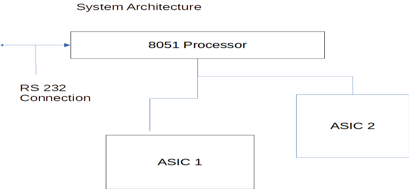
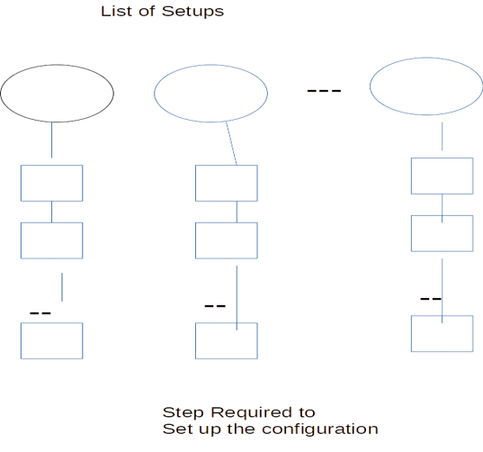
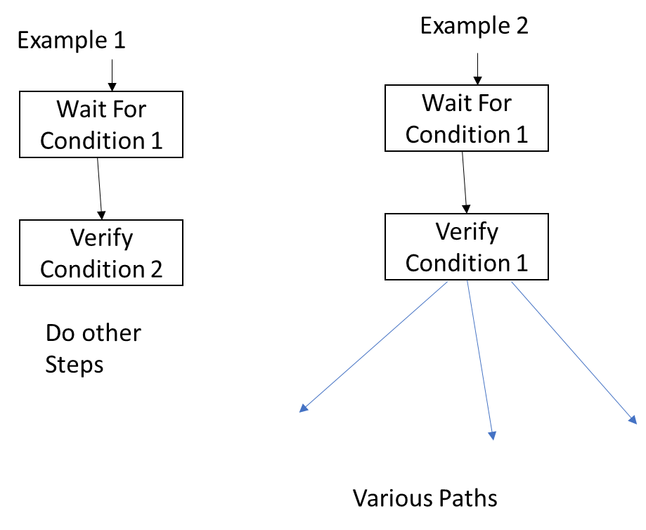

[BACK](../README.md)

# Personal Journey

This appendix documents my personal journey in developing the neocortex programming model.  I learned from my mistakes that a sufficient framework is necessary to successfully solve a problem.  If the development framework is not sufficient, then the software development will be difficult and the software will be brittle.  My journey started in the 1980’s and continues to the present.  Many concepts which are bedrock concepts were not present at the start of my journey.  

The major steps are as follows:

## 1. [Early State Machine Journey  1980 - 1991](#early-state-machine-journey--1980---1991)
## 2. [Complex State Machines 1991 - 2006](#2000-to-2006-complex-state-machines)
## 3. [Start of Neocortex programming 2006 - 2010](#2006-to-2010-start-of-the-neocortex-programming-model)
## 4. Evolution of Neocortex Programming 2010 - Present

## Early State Machine Journey  1980 - 1991
There was a time in late 1980’s, I was banished to reviewing old avionic software designs.  A common theme emerged, complicated code which involved control.  I though that state machines could solve the problem.  In the 1990’s I had a chance to put this concept to the test.
My approach was controversial at the time as the conventional approach was:
 Using a RTOS, real time operating system
Create threads based on function tasks:
Auto Pilot
Navigation 
Use Events to communicate between tasks
Within a task receive events at different places in code
This was done based upon to avoid state variables
Much of this time this approach had program control issues

My approach was based upon the following techniques
Using a RTOS, threads are based upon
Threads are created based upon:
Data Flow not functional blocks
Need for preemption of one activity over another
Later techniques such as Rate Monistic Analysis validated this approach
Threads would 
Receive Events
Process Event
Return to the Event Queue
By Returning to the Event Queue met that the program had to be broken down into states
At the time it was difficult for programmers to do this
Also, a state machine engine needed to be developed
The approach was successful on the following projects:
Satellite Terminals
Combat Radios
Set Top Boxes

In the field of Robotics, Rodney Brooks:
 introduced the concept of AFSM, Augmented Finite State Machines.  
He presented his case in the books:
Flesh of the Machine Cambrian Intelligence: The Early History of the New AI.  
His concept of control was through interacting state machines.
Author Notes:
From Rodney Brooks writing he rejected high level reasoning and designed around a reactive architecture.  In essence Rodney Brooks started with the lower level of brain and worked up.  Similar to my journey with state machines.   
[TOP](#personal-journey)

## 2000 to 2006 Complex State Machines

The nature of embedded system became more complex.  This resulted in more complex state machines.  More and more features were needed to be added to the state machine engine.
Sub States with Sub States
Sub States reduce the complexity of the overall state machine.
Without Sub States the Complexity of the overall state machine increases combinatorically.
Special Events to switch state machine state
The easiest way to switch states is to use an event.
There is a problem in that the events are in a queue.  The state change needs to happen right away, but there could be events in the stream related to old state.  This resulted in that events need to have priorities.
Need to synchronize the event streams.
When switching states, old events in the queue may not be relevant to the new state.
This results in the need for events to synchronize the event queue
The complexity of the state machines was such, that the state machine engines could not be built by hand.  Automated means were needed.

Overtime problems arose with state machines
 The first problem was that complex state machines are brittle.
The realization came during the development of a set top box with many complex features.
This resulted in a very complicated hierarchical state machine to control the system.
We had to add an optical interface to speakers in the system.  The entire state machine had to be rewritten
The second problem was sequences.  To implement each step in a sequence requires a separate state and, in some cases a separate state machine.
This became a recurring theme.

From an AI and a Robotics Framework there was a problem.  
How to find a Framework which could handle and reactive systems and planning systems.
Reactive Systems are needed to for real time control
Reactive Systems needed state machines
Planning systems require dealing with sequences.
State machines are inefficient to handle complex sequences

[TOP](#personal-journey)

## 2006 to 2010 Start of the Neocortex Programming Model

During the start of this time frame, I was given a problem which led to the start of a 1000 brain concept.
The problem was on a battery powered radio 
with an 8051 processor in one section of radio.  
Very slow clock speed because of power restriction due to battery operated
Processor speed did not meet real time demands
A series of software patches were done which 
Solved one problem
But created others
The hardware architecture is shown on the next slide

Description of Software Problem

The purpose of the 8051 solution was to set configuration based on I/O from an ASIC and commands from the serial line.
Based up comman

ds and previous system states a hardware setup is done.
The Setups can be visualized on the next page

Complexity of Setups

The Setups are not simply set hardware registers
Rather the steps involve time delays while waiting for conditions
And aborting the sequence if the  condition does not occur during a specific time delay
Also, conditions must be verified while other initialization steps are done.
Also, there are different paths based upon state variables.
The next slide shows the conditions

The 8051 processor has limited ability to access external memory and the stack resides inside of the on-chip memory of 256 bytes.
Complicated RTOS operations and Nested State Machines are not available to be implemented.
Hindsight revealed that a more capable processor, would have allowed a more conventional solution.
The limited ability of the 8051-processor lead to a novel approach.
At the time there was no connection to a 1000 brain model.  However the approach implemented was an architecture similar to the neocortex columns.

[TOP](#personal-journey)
